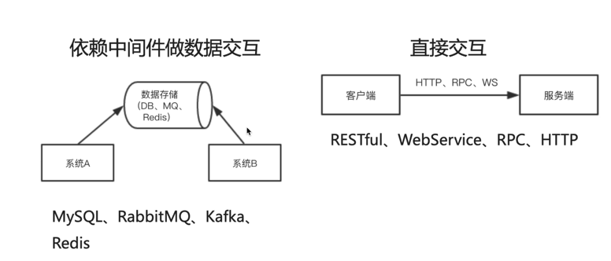
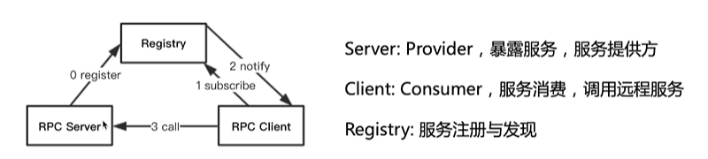
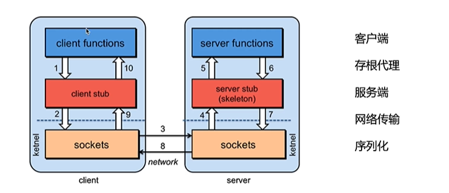
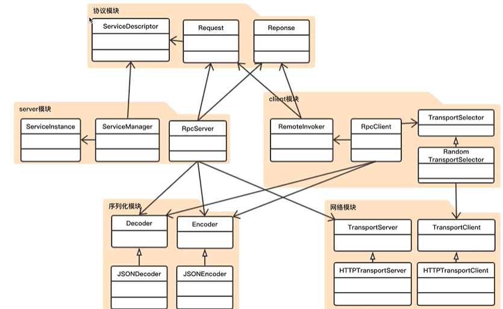

学习RPC，并且最后做一个简单的rpc项目

# 理论篇

## 概念简述

### RPC

Remote Procedure Call 即 远程过程调用，分布式常见的通信方法，已经从跨进程发展到了如今的跨物理机。

### 跨进程的交互方式

RESTful、WebService、HTTP、基于DB做数据交换、基于MQ做数据交换以及RPC

> 既然有HTTP为什么要有RPC？ 就和普通话和方言一样，虽然普通话已经很方便，但是有些时候没有方言方便。

## 图解交互形式-现有框架对比

### 图解交互形式


基于中间件的方式：耦合度低，同时一定程度进行了削峰，先把消息发到中间件，后面消费者有空了再去取消息进行消费即可。

直接交互：对发送者的发送速度和消费者消费速度有比较高的要求。

三个主要的概念：消费者、提供者、存根\服务描述（Stub）

### 现有框架对比


## 核心原理

### 整体架构



服务提供者向注册中心注册服务，消费者订阅服务，注册中心不停给消费者响应服务状态（如服务地址），消费者（知道远程服务地址）调用远程服务。

### 过程描述



存根作为中间代理进行加密、解密并且序列化、反序列化，就跟网络协议中的表示层一样。

存根还会根据对象信息中的接口调用的信息去寻找指定的服务接口具体实现类（通常出于性能考虑，实现类都用单例模式），
找到server后会通过反射来调用方法，接着会存根会把处理结果进行加密、序列化后，传递到Sockets层进行传输。

## 技术栈

- JavaCore、Maven、反射（在别的语言也叫自省）
- 动态代理（生成client存根实际调用对象，这里动态代理默认使用Java的动态代理）
- 序列化（使用fastjson，主要是因为字符串和byte数组转换方便）
- 网络通信（传输序列化后的数据，这里使用Jetty、URLConnection）

> 一般RPC都是用TCP做长连接通信，而用HTTP的场景也是有的，
> 如简单且不愿意多开放网络端口以避免出现安全问题，就可以使用HTTP

# 实战篇

这里先使用HTTP进行一下测试，实现一个简单的RPC，如Feign其实也是一个伪RPC，基于HTTP

## rpc-http架构



### 协议模块

定义客户端和服务端之间通信的协议
- Request指定请求携带的参数
- Response指定返回的信息
- ServiceDescriptor服务描述信息

### 序列化模块

对象和二进制数据之间的互转，基于Json实现

### 网络模块

Client和Server端，基于HTTP实现

### Server模块

- RpcServer
- ServiceManager维护RpcServer暴露的服务
- ServiceInstance维护RpcServer暴露的服务的具体实现

### Client模块

- RemoteInvoker把客户端的请求和Server进行交互
- Selector随机事件选择器

## 具体实现过程

### 创建工程、指定协议、通用工具方法

### 实现序列化模块

### 实现网络模块

通过使用场景，对网络做一层抽象

### 实现Server模块

服务暴露模块，并且对服务做管理

### 实现Client模块

动态代理，代理对象内部会通过网络通信与server通信

### rpc-http使用案例    

对自定义实现的框架进行使用

## 错误记录

### getPublicMethods

千万不能写成clazz.getMethods(),否则会把很多Object类中的public方法包含进来，如hashCode

```java
public static<T> Method[] getPublicMethods(Class<T> clazz){
    return Arrays.stream (clazz.getDeclaredMethods ())
            .filter (m-> Modifier.isPublic (m.getModifiers ()))
            .toArray (Method[]::new);
}
```

## 参考

> 1. HttpURLConnection对象不能直接构造，需要通过URL类中的openConnection()方法来获得。 
> 2. 对HttpURLConnection对象的配置都需要在connect()方法执行之前完成，因为connect()会根据HttpURLConnection对象的配置值生成HTTP头部信息。 
> 3. HttpURLConnection的connect()函数，实际上只是建立了一个与服务器的TCP连接，并没有实际发送HTTP请求。HTTP请求实际上直到我们获取服务器响应数据（如调用getInputStream()
     > 、getResponseCode()等方法）时才正式发送出去。 
> 4. HttpURLConnection是基于HTTP协议的，其底层通过socket通信实现。如果不设置超时（timeout），在网络异常的情况下，可能会导致程序僵死而不继续往下执行。 
> 5. HTTP正文的内容是通过OutputStream流写入的， 向流中写入的数据不会立即发送到网络，而是存在于内存缓冲区中，待流关闭时，根据写入的内容生成HTTP正文。 
> 6. 调用getInputStream()方法时，返回一个输入流，用于从中读取服务器对于HTTP请求的返回信息。 
> 7.我们可以使用HttpURLConnection.connect()方法手动的发送一个HTTP请求，但是如果要获取HTTP响应的时候，请求就会自动的发起，比如我们使用HttpURLConnection.getInputStream
     > ()方法的时候，所以完全没有必要调用connect()方法。

# 总结

## 亮点

- Maven多模块的管理
- 通过动态代理进行服务调用 

## 缺点

- Java动态代理只能代理实现了接口的类
- 
